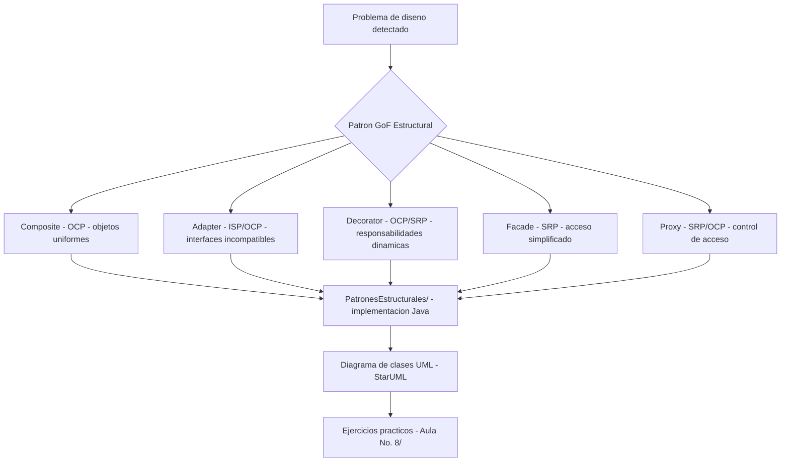

# Diseño de una Aplicación con Patrones Estructurales GoF

> Implementación propia de patrones estructurales GoF aplicados a un sistema de información real: análisis de problemas de diseño, modelado UML y código fuente Java.

## Descripción

---

Proyecto de diseño de software desarrollado por **Alejandro De Mendoza** que implementa cinco **patrones estructurales de la familia GoF (Gang of Four)**: Composite, Adapter, Decorator, Facade y Proxy. Cada patrón es analizado en términos del problema de diseño que resuelve, modelado mediante diagrama de clases UML e implementado en Java, demostrando cómo mejoran el acoplamiento, la extensibilidad y la reutilización del código.

## Patrones implementados

| Patrón | Problema que resuelve | Principio SOLID reforzado |
|---|---|---|
| **Composite** | Tratar objetos individuales y composiciones de forma uniforme | OCP |
| **Adapter** | Compatibilidad entre interfaces incompatibles | ISP / OCP |
| **Decorator** | Añadir responsabilidades a objetos dinámicamente sin herencia | OCP / SRP |
| **Facade** | Simplificar el acceso a un subsistema complejo | SRP |
| **Proxy** | Control de acceso y comportamiento adicional sobre un objeto real | SRP / OCP |

## Arquitectura

## Contenido del repositorio

| Archivo / Carpeta | Descripción |
|---|---|
| `PatronesEstructurales/` | Implementaciones Java de los 5 patrones GoF |
| `Aula No. 8/` | Ejercicios prácticos propios — sesión de diseño 8 |
| `Apoyo en aula.docx` | Notas propias de análisis de patrones |
| `Apoyo en aula2.docx` | Ampliación de notas y reflexiones de diseño |
| `Material de Apoyo.docx / .pdf` | Documento propio de estudio y síntesis |

## Tecnologías y herramientas

- **Java** — implementación de los patrones estructurales
- **StarUML / UML** — diagramas de clases y relaciones
- **Principios SOLID** — guía de decisiones de diseño

## Contexto académico

**Asignatura:** Ingeniería de Software
**Institución:** Ingeniería Informática
**Autor:** Alejandro De Mendoza — Ingeniero Informático · Especialista en IA · Especialista en Ingeniería de Software · Máster en Arquitectura de Software

[@AlejoTechEngineer](https://github.com/AlejoTechEngineer)
